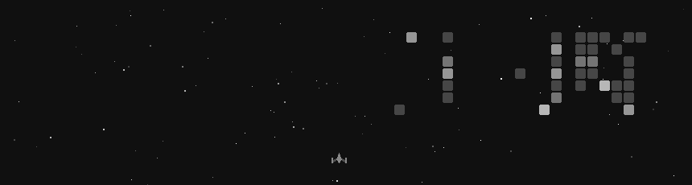

<div align="center">


<br/>

# Shakti Vijay

<br/>


</div>

<br/>

<div align="center">

## ✦ About Me ✦

</div>

<table align="center" cellpadding="12" cellspacing="0" border="0">
<tr>
<td width="60%" valign="top">

```
SHAKTI VIJAY
──────────────────────────────────

# contact
Email ................... vijayrox1955@gmail.com
LinkedIn ................ linkedin.com/in/shaktidev
GitHub .................. github.com/shaktivijayas
Portfolio ............... portfolio-seven-gray-25.vercel.app
Instagram ............... instagram.com/notshakti._

# languages
Frontend ................ React, Next.js, Three.js, Tailwind
Backend ................. Node.js, Express, FastAPI, Flask
Core .................... Python, TypeScript, JavaScript
Database ................ PostgreSQL, MongoDB
DevOps .................. Docker, Kubernetes, Vercel
AI / ML ................. OpenAI, LangChain, Gemini
```

</td>
<td width="40%" align="center" valign="top">


</td>
</tr>
</table>

<br/>

<div align="center">


</div>

<table align="center" cellpadding="12" cellspacing="0" border="0">
<tr>
<td width="60%" valign="top">

```
SHAKTI VIJAY
──────────────────────────────────

# about
Role ...................... CS Undergrad · AI/ML & Full-Stack
Education ................. B.E. CSE, Chennai Institute of Tech
Intern ................... @ Prodapt Solutions,@ Chain-sys pvt Ltd

# skills
Languages ................. JavaScript, TypeScript, Python, Java
Frontend .................. React, Next.js, HTML/CSS
Backend ................... Node.js, Express, Flask, FastAPI
Databases .................. MySQL, PostgreSQL, MongoDB
AI / ML ................... Groq, Gemini, GPT-4, RAG

# projects
Omnimind .................. Multi-tenant SaaS chatbot platform
Wraith .................... Adaptive AI fighting game
Shot Architect ............ Multi-model video production
GradePath ................. Academic analytics dashboard
```

</td>
<td width="40%" align="center" valign="top">


</td>
</tr>
</table>

<br/>

<div align="center">



</div>

<br/>

<div align="center">


<br/><br/>

✨ *Thanks for stopping by* ✨

</div>
